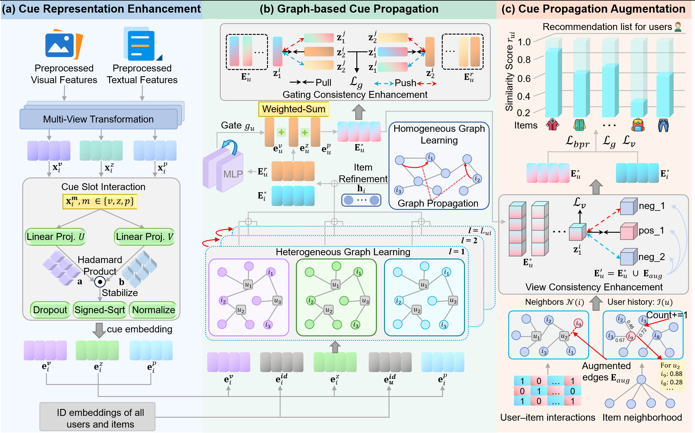

# Cues Tell the Story: Cue-driven Preference Propagation Learning for Multimodal Recommendation

## Introduction

This is the Pytorch implementation for our paper: Cues Tell the Story: Cue-driven Preference Propagation Learning for Multimodal Recommendation

## Overview

The structure of our model is available for viewing in the following:

   

### Enviroment Requirement

Python==3.8,

Pytorch==2.0.0,

Install all requirements with ``pip install -r requirements.txt``.

## Download data

Put the Baby, Clothing, and Sports datasets and other required data into the folder ``CPPRec/data`` by downloading from this link [Google Drive](https://drive.google.com/drive/folders/1Ne8IAzYjqu9oza_J6QV7u1JUncui0yGE?usp=drive_link).

## 3. Training on a local server using PyCharm.

Run CPPRec by ``python main.py`` with the default dataset as Baby. Specific dataset selection can be modified in `main.py`.

## 4. Training on a local server using Git Bash.

Run CPPRec by ``train.\`` with the default dataset is Baby. Specific dataset selection can be modified in `train.py`.

## 5. Modify specific parameters.

You may specify other parameters in CMD or config with `configs/model/*.yaml` and `configs/dataset/*.yaml`. 

## Acknowledgement

The structure of this code is  based on [MMRec](https://github.com/enoche/MMRec) and [TAMER](https://github.com/Z-last-ONE/TAMER). Thank for their work.